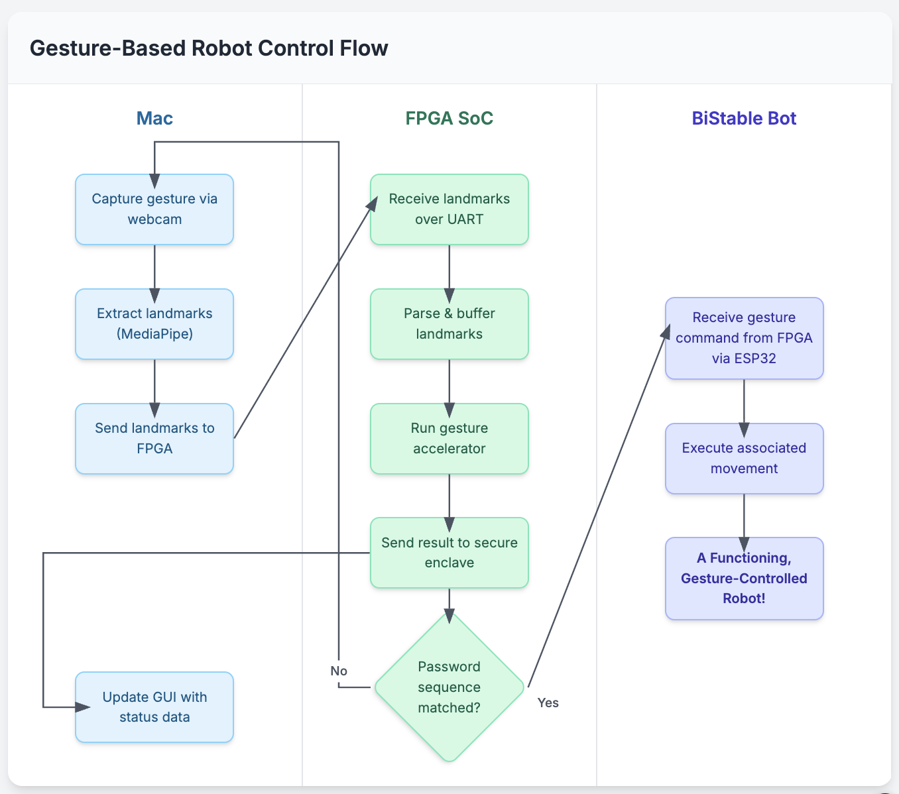

# Gesture-Driven SoC (Arty S7-25)

> Goal: build a soft RISC‑V SoC that ingests live gesture landmarks from a Mac, validates a 4‑gesture password inside a secure enclave, and—once unlocked—streams classification results to the Mac UI while issuing robot commands via an ESP32 Wi-Fi link.

---

## 1. Board & Resource Constraints

- FPGA: Xilinx Artix-7 XC7S25 (≈14.6k LUTs, 29k FFs, 80 DSPs)
- On-chip RAM: ~202 KB block RAM; plan a SRAM-like scratchpad plus caches.
- External memories: 256 MB DDR3L via Xilinx MIG, 16 MB QSPI flash (boot + assets).
- Built-ins: quad switches, buttons, LEDs, USB-UART bridge.

**Design implications**

1. Keep logic lean—start with a multicycle RV32 core (or very small pipeline) and modest caches/SRAM.
2. Use BRAM for boot ROM and small OS; stream/patch larger binaries from QSPI.
3. Enable MIG/DDR only once SoC skeleton is stable; accelerator weights can live in BRAM initially.

---

## 2. System Architecture Overview

### Data flow
1. Mac webcam → MediaPipe landmarks → host app packages features via USB-UART.
2. FPGA SoC:
   - Host link parser writes vectors into shared SRAM.
   - Gesture accelerator consumes vectors, outputs class ID.
   - Secure enclave compares gestures to stored sequence.
   - On unlock, main CPU routes gesture → robot command queue, toggles radio enable.
3. ESP32 handles Wi-Fi transport to robot.
4. FPGA sends status frames (lock state, classifications, telemetry) back to Mac GUI.

### Execution domains
- **Main CPU** (RV32I/M): runs micro-OS, drivers, scheduler.
- **Gesture accelerator**: fixed-point MAC/pipeline for quantized MLP.
- **Secure enclave**: hardened coprocessor or small secondary core with isolated RAM.
- **Peripherals**: UART (host link), SPI(QSPI) flash, second SPI for ESP32, timer/interrupt controller, optional debug GPIOs.

---

## 3. Hardware Modules to Implement (SystemVerilog)

| Block | Purpose | Starting point |
|-------|---------|----------------|
| `rv32_core` | Multicycle or short pipeline RV32I(M) core with CSR, ECALL, IRQ support | `linux_socs/linux_nommu_multicycle_harris_riscv_rv32ima/kianv_harris_edition` |
| `timer_clint` | Machine timer/soft interrupt (mtime/mtimecmp, msip) | `engineering/clint.v` |
| `interrupt_plic` | External interrupt controller for UART/accelerator events | `engineering/plic.v` |
| `sram_ctrl` | Dual-port BRAM interface for instruction/data | simple inferred BRAM wrapper |
| `qspi_flash_if` | Bootloader + asset fetch from external flash | adapt `engineering/qqspi.v` |
| `uart_host` | USB-UART bridge into FIFO/register map | adapt `engineering/tx_uart.v` / `rx_uart.v` |
| `spi_esp32` | SPI master for ESP32 module (cmd queue, handshake) | reuse `engineering/spi.v` with new glue logic |
| `gesture_accel` | MLP matrix-vector engine (load weights, start/done, IRQ) | custom; use DSP48 slices |
| `secure_enclave` | Independent FSM or RV32 core + mailbox, private BRAM | new module; interface via memory-mapped mailbox |
| `soc_bus` | Simple memory bus/arbiter mapping address ranges | trim `engineering/soc.v` for essentials |
| `clock_reset` | PLL/MMCM for system clock + resets | Vivado IP (60–100 MHz target) |
| `debug_gpio` | LEDs, buttons, optional logic analyzer taps | simple registers |

**Address map (example)**  
```
0x0000_0000 – 0x0000_FFFF  : Boot ROM (BRAM)
0x1000_0000 – 0x1000_FFFF  : SRAM scratchpad (BRAM / MIG window)
0x1100_0000 – 0x1100_00FF  : UART host registers
0x1100_0100 – 0x1100_01FF  : SPI ESP32 bridge
0x1100_0200 – 0x1100_02FF  : Gesture accelerator control/status
0x1100_0300 – 0x1100_03FF  : Secure enclave mailbox/status
0x1100_0400 – 0x1100_04FF  : GPIO/LEDs (optional)
0x1110_0000 – 0x1110_FFFF  : CLINT (mtime/msip)
0x1111_0000 – 0x1111_FFFF  : PLIC
0x2000_0000 – …            : QSPI flash memory window (execute or DMA)
```

---

## 4. Software Stack (Tiny OS)

### Toolchain setup
- Build or install RISC-V GCC (rv32im-elf) + binutils, newlib for bare metal.
- Use OpenOCD/JTAG for debug or UART bootloader for quick iteration.

### Kernel stages

1. **Boot stub (assembly)**  
   - Setup stack pointer, zero BSS, jump to `main()`.
   - Enable machine interrupts, configure trap vector.

2. **HAL & drivers (C)**  
   - `uart_driver`: init baud, TX/RX FIFOs, interrupt service routines for command packets.
   - `spi_driver`: configure SPI for ESP32, provide async send/receive.
   - `qspi_driver`: minimal routines to read code/data from flash (for updates).
   - `timer_driver`: program CLINT for periodic tick.
   - `accel_driver`: load weights/config, trigger inference, handle completion IRQ.
   - `enclave_driver`: write password sequence, poll/interrupt for unlock result, manage secure memory window.
   - Optional `gpio_driver` for debug.

3. **Scheduler & task model**  
   - Start simple cooperative tasks; upgrade to pre-emptive when comfortable.
   - Cooperative loop: tasks yield at safe points; time slice triggered by CLINT tick.
   - Data structures: task control block with stack pointer, registers, message queues.
   - Context switch: C routine plus assembly to save/restore registers.

4. **Middleware**  
   - Message queues between tasks (e.g., landmarks queue, UI event queue).
  - Simple command protocol encoder/decoder for Mac host.
   - State machine for unlock workflow.

5. **Application layer**  
   - Task A: host link (receive landmarks, send UI updates).
   - Task B: gesture pipeline (trigger accelerator, push results).
   - Task C: secure enclave interface (enrollment, verify, status).
   - Task D: robot control (send commands via ESP32, monitor ack).
   - Optional Task E: logging/diagnostics over UART.

### Mac-side helper app
- Python or Swift app to capture webcam (if not already done elsewhere), serialize landmarks, parse status frames, render GUI (lock state, recognized gestures, robot telemetry).

---

## 5. Development Phases

### Phase 0 – Study & Planning
- Read KianV `linux_nommu` SoC for structure ideas.
- Review Arty S7 reference manual, MIG example designs.

### Phase 1 – Minimal SoC Bring-Up
1. Create Vivado project with:
   - RV32 core.
   - BRAM boot ROM/SRAM.
   - UART (connected to USB).
   - CLINT timer (for delays).
2. Write bare-metal “hello world” (UART print, LED blink).
3. Verify toolchain, FPGA programming flow, debug UART.

### Phase 2 – Add OS Primitives
1. Add PLIC support, enable machine external interrupts.
2. Implement timer tick + cooperative scheduler.
3. Create task structure: host I/O, heartbeat LED, command parser.
4. Add simple message queue between tasks.

### Phase 3 – Host Communication Protocol
1. Define packet format (e.g., start byte, length, payload, CRC).
2. Implement host UART driver + ISR ring buffer.
3. Build Mac test app sending dummy landmarks, receiving echoes.
4. Integrate into OS task (parse, ack, schedule jobs).

### Phase 4 – Gesture Accelerator Prototype
1. Design fixed-point matrix-vector unit:
   - Parameterized layer sizes (matching quantized model).
   - BRAM-based weight storage; CPU loads weights at boot.
   - Control register (`start`, `busy`, `done`, `irq_en`).
2. Develop driver to load weights, trigger inference, read logits.
3. Validate with known landmark vectors via simulation (e.g., Verilator + Python).
4. Benchmark latency/resource usage.

### Phase 5 – Secure Enclave
1. Choose architecture:
   - FSM storing hashed gesture codes in private BRAM with command interface.
   - Or second RV32 core (simpler if reusing existing code) with mailbox.
2. Define mailbox registers: write gesture ID, signal ready, read unlock status.
3. Enforce separation: enclave RAM not mapped into main CPU address space except through controlled interface.
4. Implement enrollment (store 4-gesture sequence) and verification logic.
5. Create OS driver & API.

### Phase 6 – ESP32 Interface
1. Configure ESP32 firmware to accept SPI/UART commands, send telemetry.
2. Implement FPGA SPI master block (CS, CLK, MOSI, MISO, IRQ).
3. Build driver with command queue, state machine for connection status.
4. Integrate unlocking gating: tasks enable/disable bridge based on enclave result.

### Phase 7 – OS Feature Complete
1. Upgrade scheduler to pre-emptive (optional):
   - Set CLINT tick (e.g., 1 ms), implement context save/restore in ISR.
   - Ensure drivers are ISR-safe (ring buffers, lock-free queues).
2. Flesh out tasks:
   - Host UI: send JSON or binary status frames.
   - Gesture pipeline: maintain sliding window for password sequence, call enclave.
   - Robot control: command translation, retry, ack.
3. Add logging/tracing (optional) via UART or debug pins.

### Phase 8 – Testing & Optimization
1. Unit-test drivers in simulation (UVM-lite or simple benches).
2. Hardware-in-loop tests with recorded landmark sequences.
3. Measure latency end-to-end; adjust accelerator parallelism or scheduling.
4. Optimize resource usage (reduce BRAM duplication, share DSPs).

---

## 6. Learning Checklist

### Hardware (SystemVerilog)
- Memory-mapped bus design and arbitration (simple interconnect vs. AXI-lite).
- BRAM inference, clock gating, reset sequencing.
- Fixed-point arithmetic and DSP slice usage.
- Interrupt wiring (CLINT/PLIC semantics).
- Secure enclave design patterns (isolation, mailbox communication).

### Software (C/Assembly)
- Bare-metal RISC-V startup (linker scripts, CRT0).
- CSR manipulation (mstatus, mie, mip, mtvec, mepc).
- Interrupt handling and context switching.
- Cooperative vs. pre-emptive scheduling strategies.
- Driver design for UART/SPI/accelerators.
- Simple serialization protocols.

### Tools
- Vivado (synthesis, floorplanning, timing analysis).
- RISC-V GCC/newlib toolchain.
- OpenOCD/JTAG or UART bootloaders.
- Verilator (cycle-accurate simulation with C++/Python cosim).
- Logic analyzer/ILA for hardware debugging.

---

## 7. Suggested Reading & References

- *Digital Design and Computer Architecture* (Harris & Harris) – CPU + memory systems fundamentals.
- *The RISC-V Reader* (Patterson & Waterman) – ISA quick reference.
- “KianV linux_nommu SoC” (this repo) – reference for barebones RV32 SoC structure.
- SiFive CLINT/PLIC specs – official behavior of timer & interrupt controllers.
- Xilinx UG471 MIG Guide – DDR3 controller integration.
- “Writing a Simple Operating System from Scratch” (Nick Blundell) – high-level OS path.
- “RISC‑V privileged spec” – CSR/interrupt behavior.

---

## 8. Milestone Checklist

- [ ] Minimal SoC boots, UART prints, LED blinks.
- [ ] Timer/interrupt working; cooperative scheduler running multiple tasks.
- [ ] Robust UART protocol with Mac application.
- [ ] Gesture accelerator integrated, inference verified vs. PC reference.
- [ ] Secure enclave storing/verifying 4-gesture password.
- [ ] ESP32 bridge sends commands to robot.
- [ ] OS handles multitasking (pre-emptive optional) + drivers clean coverage.
- [ ] Mac GUI displays unlock state, gesture stream, robot status in real time.
- [ ] Latency benchmarked; optimizations applied.

---

## 9. Next Steps

1. Decide which RV32 core baseline to start from.
2. Spin up a Vivado project with the minimal SoC (CPU + ROM + UART) and verify toolchain.
3. Sketch the host packet format + state machine for password flow before coding drivers.
4. Plan the secure enclave architecture (FSM vs. micro-core) so hardware and software develop in parallel.

Good luck, and iterate on the plan as you explore each block!

---

## 10. Flowchart Descriptions

### 10.1 High-Level System Flow (Mac ↔ FPGA ↔ Robot)



1. **Start / Power-On**
2. **Mac: Capture Gestures**
   - Webcam feed processed by MediaPipe to extract 3D landmarks.
3. **Mac: Feature Packetization**
   - Normalize landmarks, wrap into UART packet (header + length + Cyclic Redundancy Check (CRC)).
4. **USB-UART Bridge**
   - Packet transmitted over USB cable to FPGA UART.
5. **FPGA: Host Link Interface**
   - UART Interrupt Service Routine (ISR) stores packet in RX FIFO, validates checksum, writes landmarks into shared SRAM buffer.
6. **FPGA: Gesture Pipeline Task**
   - OS schedules task to trigger gesture accelerator with new feature vector.
7. **Gesture Accelerator**
   - Fetches landmarks + weights from SRAM/BRAM, computes fixed-point inference, raises Interrupt Request (IRQ) with class ID + confidence.
8. **FPGA: Secure Enclave Interaction**
   - Gesture pipeline task writes class ID to enclave mailbox.
   - Enclave compares sequence against enrolled 4-gesture password.
9. **Decision Branch**
   - **If password not yet satisfied:** enclave returns “locked” and remaining sequence info.
   - **If sequence matches:** enclave asserts “unlocked” status.
10. **FPGA: Main OS Task Routing**
    - Packages status for GUI display (gesture label, lock state, confidence, robot command preview).
11. **Mac Feedback Path**
    - Status frame sent over UART back to Mac.
    - Mac GUI renders live state: gestures, password progress, unlock status, telemetry.
12. **Unlock Branch**
    - **If locked:** loop back to wait for next gesture packet.
    - **If unlocked:** OS enables robot control task.
13. **FPGA → ESP32 Bridge**
    - Robot control task formats command, pushes to SPI FIFO.
    - SPI master transmits to ESP32, optionally waits for ACK.
14. **ESP32 → Robot**
    - ESP32 forwards movement command via Wi-Fi.
15. **Robot executes command**
16. **Loop**
    - Continue streaming status to Mac and commands to robot until session ends.
17. **Power-Off / Reset**

Use this sequence to generate a swimlane or process flow with three lanes (Mac, FPGA, Robot).

### 10.2 FPGA Internal Architecture & OS Flow

1. **Clock/Reset Generation**
   - Phase-Locked Loop/Mixed-Mode Clock Manager (PLL/MMCM) creates system clock; reset controller releases modules.
2. **CPU Core Initialization**
   - RV32 core exits boot ROM, sets up stack.
3. **OS Boot Sequence**
   - Initialize `.bss`, configure trap vector, enable interrupts.
4. **Driver Initialization**
   1. UART host driver (connect ISR ring buffer).
   2. SPI ESP32 driver (configure clock, CS).
   3. Gesture accelerator driver (load weights, set IRQ).
   4. Secure enclave driver (mailbox base address).
   5. Timer/CLINT (Core-Local Interrupt Controller) driver (program tick interval).
5. **Scheduler Start**
   - Create task control blocks (TCBs).
   - Tasks registered: `HostLink`, `GesturePipeline`, `EnclaveManager`, `RobotControl`, optional `Logger`.
6. **Main Loop / Idle Task**
   - Wait for interrupts (WFI) when no runnable tasks.
7. **Interrupt Events**
   - **UART RX IRQ:** ISR pushes packet bytes; when packet complete, signals `HostLink`.
   - **Timer IRQ (CLINT):** triggers scheduler tick, handles timeouts.
   - **Accelerator IRQ:** indicates inference ready; wakes `GesturePipeline`.
   - **Enclave IRQ (optional):** signals password decision.
   - **SPI DMA/ACK IRQ (optional):** notifies `RobotControl`.
8. **Scheduler Dispatch**
   - Saves current context, selects next ready TCB, restores context.
9. **HostLink Task**
   - Parses packets, writes landmarks to shared buffer, posts job to `GesturePipeline`.
10. **GesturePipeline Task**
    - Starts accelerator, waits for completion event, reads logits, hands result to `EnclaveManager`.
11. **EnclaveManager Task**
    - Exchanges mailbox messages with secure enclave (write class ID, read status).
    - On unlock, sets shared flag enabling `RobotControl`.
12. **RobotControl Task**
    - If `unlocked`, formats command (direction, speed) for ESP32 and queues SPI transfer.
13. **Status Broadcast Task (could be part of HostLink)**
    - Builds status frame (gesture, lock state, robot telemetry), sends via UART TX.
14. **Secure Enclave Module**
    - Isolated BRAM keeps password sequence.
    - FSM/stateful logic updates match progress, asserts unlock or failure.
15. **Shared Memory / Bus Arbiter**
    - Simple crossbar routes CPU, accelerator, enclave, and peripheral accesses to BRAM/QSPI/IO.
16. **Return to Scheduler**
    - Tasks yield or block, scheduler selects next runnable task.
17. **Shutdown**
    - On reset command, tasks flushed, hardware reset asserted.
